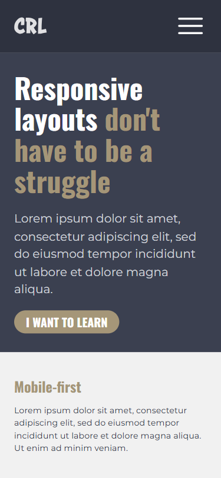
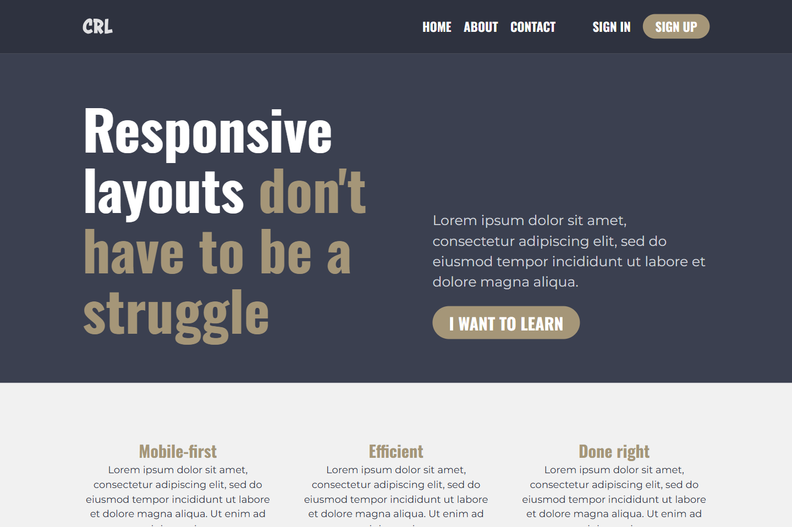

# 💻 Conquering Responsive Layouts

## ℹ️ A Responsive Website Built with HTML, CSS, & JavaScript

| _Mobile Preview (375x812)_                       | _Desktop Preview (1440x960)_                        |
| ------------------------------------------------ | --------------------------------------------------- |
|  |  |

A fully responsive, accessible, and mobile-first website built from a professional PDF design.

This project was created as the final challenge for Kevin Powell's [21-day Conquering Responsive Layouts](https://courses.kevinpowell.co/conquering-responsive-layouts) course.

---

## 🔍 Overview

This website features a three-section landing layout: a hero with CTA, a features grid, and a highlight section with responsive text and imagery. A toggleable navigation bar is built for mobile-first behavior and transforms into a horizontal layout for larger screens.

The project emphasizes design fidelity, accessibility, and responsive techniques using only HTML, CSS, and JavaScript. No frameworks or component libraries were used — everything was written from scratch.

---

## ✨ Features

- Semantic and accessible HTML5 structure
- Responsive layout with `@media` queries
- Mobile-first navigation toggle menu
- Custom CSS variables and modular styles
- ARIA attributes and keyboard support for better accessibility
- Visual consistency from mobile to desktop screens
- Layout follows a professionally designed PDF (not Figma)
- Interactive navigation toggle with outside click and Escape key handling

---

## 🧠 What I Learned

- Writing accessible navigation using `aria-expanded`, keyboard event handling, and outside-click detection
- Structuring layouts using mobile-first principles and CSS Grid/Flexbox combinations
- Using custom properties (CSS variables) to maintain a scalable design system
- Debugging and aligning elements to pixel precision using design previews
- Separating concerns between structure (HTML), style (CSS), and behavior (JavaScript)
- Setting up organized folder structure for scalable projects

---

## 🛠️ Tech Used

- HTML5
- CSS3
- JavaScript
- Git
- GitHub
- Netlify

---

## 🚀 How to Run

1. Clone the repository
2. Open `index.html` in your browser

---

## 🌐 Live Demo

Or you can check out the 👉 [live website here](https://conquering-responsive-layout-jiro.netlify.app/)

---

## 🧑‍💻 Author

Created by **Elmar Chavez**

🗓️ Month/Year: **June 2025**

📚 Journey: **3rd** month of learning _frontend web development_.
